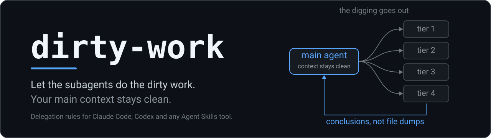

# dirty-work

[English README](README.md)

**你的 AI 明明有帮手，却还是什么都自己读。**

这个技能让主 Agent 把调查和大批量阅读派给子 Agent（帮主 Agent 干活的帮手），只收回当前任务用得上的结论，不收回一大堆原始材料，并把每件活派给刚好能干好它的最小一档模型。上下文不再被没用的东西撑坏（context rot），最贵的模型少烧 token，而且顺序是定死的：先把活干对，再保上下文干净，最后才是省 token。让小弟去 do the dirty work。

[](LICENSE)
[](#验证范围与局限)
[](#安装)
[](#常见问题)
[](CHANGELOG.md)

```bash
npx skills add humeicw/dirty-work
```

## 用前用后对比

同一句话，干了一小时之后："查一下上周合并之后构建为什么挂了。"

| 一小时之后 | 没装这个技能 | 装了 dirty-work |
|---|---|---|
| 它怎么查 | 自己搜、自己开文件、自己拉构建日志，全部堆进主对话。 | 派一个子 Agent 去翻，带回来的是根本原因和真正相关的那几行。 |
| 主对话里的 token | **约 18 万** | **约 6 万** |
| 上下文窗口用掉 | **90%**，提示"上下文快满了，正在压缩" | **30%** |
| 这些上下文里和你的问题真正有关的 | **约 15%** | **约 85%** |
| 读完 100 万 token 的日志和文件要花 | 用最贵的模型：**10 美元** | 用 1 档或 2 档模型：**1 到 2 美元** |

*示意数字：按 20 万 token 的上下文窗口、一次典型的排查任务估的整数，用来说明量级，不是测试结果。价格是 2026-09-19 的官方输入标价。*

我自己 14 天真实工作记录里的数字：

| 实测 | |
|---|---|
| 子 Agent 读掉的材料 | 约 1900 万 token |
| 回到主对话的 | 约 4.09 万 token，占 0.21% |
| 每次派活带回来的内容（中位数） | 272 token |
| 发生在子 Agent 那边的文件读取和命令执行 | 88% |
| 唯一一次完全没派活的会话（2026-09-03，约 4 小时） | 主对话从 6.5 万 token 涨到 29 万 |

这些数字怎么数的、不能说明什么，见[我实测了什么](#我实测了什么)。

## 它怎么工作

**第一，调查和大批量阅读派出去。** 需要边查边摸索的事（哪份文件说了算、我们漏了什么），连同还没搞清楚的问题一起派给子 Agent。需要弄懂一大堆材料的活，交给专门负责阅读的子 Agent。主 Agent 只读入口文件和状态记录，不读那堆材料，也不许为了"把工单写清楚"先自己调查一遍。

**第二，子 Agent 带回来的是结论，不是原始材料。** 工单（交给子 Agent 的任务说明）要的是答案和关键证据，不是原文。子 Agent 干活期间，主 Agent 不许再做同样的搜索，也不许为了"核实"汇报而回去重读原文。

### 四个档位

定档只问一个问题：**这件活里有多少东西工单写不死，要子 Agent 自己拿主意？** 按 4 档、3 档、2 档、1 档的顺序检查，碰到第一个符合的就停。

| 档位 | 子 Agent 需要做到 | 典型任务 |
|---|---|---|
| **1 档：机械执行** | 照着写明的规则做。输入、规则、输出都写清楚了，结果能直接核对。 | 按清单替换用词、转换格式、跑一条指定命令、照给定的改动直接套用。 |
| **2 档：理解与判断** | 看懂内容，对每一项做判断，不用顾全一个整体设计。 | 读材料并汇报要点、给内容分类、在指定文件范围内改动。 |
| **3 档：多步推理** | 在多个互相牵连的步骤之间，保持同一条推理思路不断。做法和验收标准已经定好。 | 按已定的设计跨多个模块实现、从证据推出根本原因。 |
| **4 档：探索与关键决策** | 自己找出路径，或者做一个很难反悔的决定。 | 排查原因未知的故障、制定大家共用的规则、涉及生产环境的决定。 |

4 档把方向定下来之后，剩下的实现降到 3 档，范围明确的改动降到 2 档，机械性的活降到 1 档。

### 每一档用什么模型

我现在的配法，价格是 2026-09-19 的官方标价，每 100 万 token（输入 / 输出）：

| 档位 | Claude Code | 价格 | Codex | 价格 |
|---|---|---|---|---|
| 1 档 | Haiku 4.5 | $1 / $5 | gpt-5.6-luna | $0.20 / $1.20 |
| 2 档 | Sonnet 5 | $2 / $10 | gpt-5.6-terra | $2 / $12 |
| 3 档 | Opus 5 | $5 / $25 | gpt-5.6-sol | $4 / $20 |
| 4 档 | Fable 5.1 | $10 / $50 | gpt-6-astra | $10 / $50 |

1 档的价格，在 Claude 这边是 4 档的十分之一，在 OpenAI 这边是五十分之一。

**换成你自己在用的模型。** 档位是一个定义，不是某个牌子，模型名字过几个月就过时。技能正文里的档位表有一列"模型"，按你手头的模型填一次就行。在 Claude Code 里，`agents/` 下每个文件只有一行 `model:`，可以填别名、`inherit` 或完整的模型 ID；环境变量 `ANTHROPIC_DEFAULT_HAIKU_MODEL`、`..._SONNET_MODEL`、`..._OPUS_MODEL` 可以把别名指到别的模型上。在 Codex 里，改 `~/.codex/agents/*.toml` 里的 `model`，其他厂商加在 `config.toml` 的 `[model_providers]` 下。比如 DeepSeek 官方提供 Anthropic 兼容接口，可以让 `deepseek-flash` 顶 1、2 档，`deepseek-v4-pro` 顶 3、4 档。我自己只跑过 Claude 和 OpenAI 的模型。只有一条规矩：3 档和 4 档不能落在同一个模型的同一个推理强度上，否则四档就塌成三档。

## 安装

在 Claude Code 里用插件装。只有这条路会连同七个档位子 Agent 一起装上。

```
/plugin marketplace add humeicw/dirty-work
/plugin install dirty-work@dirty-work
```

装完技能的斜杠命令是 `/dirty-work:dirty-work`，七个子 Agent 出现在 `/context` 里。

> `agents/tier4-frontier.md` 出厂写的是 `model: fable`。没有这个模型权限的话，把 `model:` 改成你能用的最强模型、`effort: xhigh` 保持不动，否则每次调用 4 档都会直接报模型错误。

<details>
<summary>其他工具、手动复制、Claude 桌面版</summary>

Codex、Cursor、Gemini CLI、Copilot、OpenCode 等，用跨工具的命令行：

```bash
npx skills add humeicw/dirty-work
```

手动复制：把自包含的 `skills/dirty-work/` 整个文件夹复制到 `~/.claude/skills/`、`~/.codex/skills/`，或你那个工具的项目技能目录。想连子 Agent 一起要，把 `agents/*.md` 复制到 `~/.claude/agents/`。

Claude 桌面版 / claude.ai：把 `skills/dirty-work/` 打包成 zip 当技能上传，只带技能，不带子 Agent。

卸载方法见 [AGENTS.md](AGENTS.md)。

</details>

## 怎么让它触发

**这一步是必须的，不是可选的。** 装上技能不等于模型会去用它：Agent 往往只在觉得"这活超出我能力"时才查技能，而"我就顺手看一个文件"永远不会让它这么觉得。在你的 `CLAUDE.md` 或 `AGENTS.md` 里加这一段：

```
You must read the dirty-work skill and follow it before your first file read, grep or shell
command on any task that means investigating or debugging something, searching the
codebase, reading a lot of files or logs, a repo-wide rewrite or migration, or building
something across several files. This applies even when the task looks small. Outside that
list, do not read it: not for a single named edit, not for a question you can answer from
what is already in front of you, and not for a document you and the user are writing
together turn by turn.
```

意思是：凡是调查或排查问题、搜代码、读大量文件或日志、全仓库范围的改写或搬迁、跨多个文件的实现，在第一次读文件、搜索或跑命令之前，必须先读 dirty-work 技能并照着做，任务看起来再小也一样。不在这个范围里的就不要读：改一处指定的地方、眼前信息就能回答的问题、和用户一来一回共同写的文档。关键在"之前"两个字：等 Agent 已经读了五个文件，上下文就已经花出去了。

我做过一次[小测试](evals/trigger-smoke-test.md)（14 个文件的测试仓库，Claude Code 2.1.258，Sonnet，6 句应该触发的话各跑 2 次）：只靠技能描述，12 次里触发 3 次；加上这一段，12 次全部触发。4 句不该触发的话跑了 8 次，两种情况下都是 0 次误触发。这批话在挑措辞时也用过，所以第二轮换了 10 句从没用于调优的新话：只靠技能描述 12 次里触发 0 次，加上这一段 12 次全部触发，两种情况下误触发都是 8 次里 0 次。技能描述写的是"这个技能管哪几类工作"，不去列举用户可能说的话。早先那版列举用户原话的描述，在第一轮单靠自己能到 12 次里 8 次，换成新话后是 12 次里 0 次；另外两种改写在新话上也都是 12 次里 0 次。改描述的措辞没有用，起作用的是这一段。加上这一段后，列举版和现在的描述在第一轮都是 12 次全中。12 次全中不等于"总会触发"：样本小，只有一台机器、一个模型，每种条件只跑了一轮，而且除了 3 次抽查，这一段是用 `--append-system-prompt` 注入的，不是真的放在 `CLAUDE.md` 里。

## 我为什么做这个

2026-09-03，我让我的 Agent 做一个大型整理任务。它跑了大约四个小时，一次都没有派活给子 Agent。每一次搜索、每一个文件、全部 61 条命令的输出，都堆进了主会话，主会话从 6.5 万 token 涨到 29 万。子 Agent 从头到尾都能用，只是每一步单独看都很小。我不是专业程序员，每天用 Claude Code 和 Codex 处理自己的事，这套规则就是反复看着同一件事重演之后写下来的。

上下文不是越长越好，伤害在撑到上限之前就开始了：

- Anthropic 的子 Agent 官方文档，把"保护上下文"列为第一个好处。（[Claude Code 文档](https://code.claude.com/docs/en/sub-agents)）
- Chroma 的《Context Rot》报告，在 18 个顶尖模型上保持任务难度不变、只加长输入，可靠性远没到上限就开始下滑。（[Chroma Research，2025](https://research.trychroma.com/context-rot)）
- 论文《Lost in the Middle》（Liu 等人，[arXiv:2307.03172](https://arxiv.org/abs/2307.03172)）发现：埋在长文本中间的信息，模型用得远不如放在两头可靠。
- Anthropic 的文章《Effective context engineering for AI agents》把上下文叫作"注意力预算"。（[Anthropic Engineering](https://www.anthropic.com/engineering/effective-context-engineering-for-ai-agents)）

以上都是别人的研究结论，不是我测出来的。第二个原因是用量：包月订阅真正稀缺的是额度窗口，一件 1 档的小活放到最贵的模型上跑，烧掉的和你真正要紧的活是同一份额度。

这套规则每一条是因为出了什么事才加上的、改完效果怎样，见[这套规则是怎么改出来的](HISTORY_ZH.md)。

## 我实测了什么

我翻了自己最近 14 天的 Claude Code 会话记录（2026-09-05 至 09-19，用的是这套规则的私有版本）：19 个派过活的会话，114 次派活，外加 49 次追问。

数字在[用前用后对比](#用前用后对比)的第二张表里。档位分布：3 档占 78%，1 档和 2 档合计 20%，4 档 2%。我的活大多是多步相扣的，所以便宜档在这里是少数。

这是真实工作记录里的观察数据，任务各不相同，不是对照实验：它说明有多少东西没进主对话，不说明结果好了多少。token 数是估算值，每份材料只算一次，不把缓存重读重复计入。

## 验证范围与局限

这套决策规则有日常使用撑着，我每天在 Claude Code 和 Codex 上用它的私有版本。**但这个安装包本身测得还不多**：2026-09-23 我在一台 Windows 电脑上，用全新的空配置跑了两条安装命令，都装成功了。一条是 `/plugin marketplace add` 加 `/plugin install`（Claude Code 2.1.258），装完能看到技能和七个子 Agent；另一条是 `npx skills add`（skills 1.7.0，装给 Claude Code），技能文件完整，描述能正常读出。更早用 `claude --plugin-dir` 加载时，1 档和 4 档各成功调用了一次。从装好到在对话里真正调用，这一整套流程还没连起来测过。其他支持 Agent Skills 的工具应该能用，因为技能是纯文字，但我没试过。

- 好处是慢慢累积出来的：你会在一个跑了三小时、居然不用压缩上下文的会话里才注意到它。
- 派活不是免费的。每个子 Agent 都要重新读一遍背景，所以真正的小任务自己干反而更省。**这是我的判断，不是 `SKILL.md` 里的规则**：技能正文的默认做法是把可独立执行的活派出去。
- 1 档和 2 档的子 Agent，有时交回来的答案比主 Agent 自己做还差。技能第 7 节用升档来处理，但这要多跑一个来回。
- 触发是否可靠，是所有技能共同的弱点，这一个也不例外。不加[怎么让它触发](#怎么让它触发)里那一段的话，两轮[小测试](evals/trigger-smoke-test.md)里该触发的 24 次运行只触发了 3 次。

## 它和别的派活技能有什么不一样

我知道的同类项目大致分三类，任何一类都可能比我这个更适合你。

- **按模型分流的**：把活转给更便宜的模型，但不问"这活主 Agent 到底该不该自己干"。
- **给子 Agent 设定角色、再配一套调度程序的**：它们回答的是另一个问题，也就是帮手应该长什么样。
- **讲"什么时候该派活"的**：离我这个最近，通常是一条简短的经验法则，不是一套完整流程。

这一个是给**主** Agent 定的决策规则：工单里必须写什么、工单绝不能扩大子 Agent 的权限、什么时候换档、同一档连续错两次就升一档、每件工作只有一个负责人。它不带任何脚本。

## 常见问题

**这名字听着像是把讨厌的活甩给别人。**
名字确实是个玩笑，但只玩笑了一半。读文件、搜代码这些活确实甩出去了，甩不出去的是责任：工单是主 Agent 写的，答案够不够格是主 Agent 判的，最后向你交代的还是主 Agent。

**派子 Agent 不是更费 token 吗？**
总量上常常确实更费，因为每个子 Agent 都要重新读一遍背景。少掉的有两样：一是主对话里的 token，主对话是那个必须连续几个小时保持清醒的地方；二是烧在最贵模型上的 token，读 100 万 token 的日志，用我的 4 档模型要 10 美元，用 1 档只要 1 美元。账单会不会降，看你的活怎么分布。我自己的活大多是 3 档，所以我图的是上下文干净，不是账单变小。

**我的模型上下文很大，工具还会自动压缩，为什么还不够？**
上下文更大只是把压缩推迟了。按上面引的那些研究，它并不能消除"输入越长、表现越不可靠"这件事，而且压缩过的会话已经丢掉了一些细节。这是我对那几篇研究的理解，不是我测出来的。

## 参与贡献与许可证

现阶段 issue 比 pull request 更有用，尤其是"明明该触发却没触发"的例子，请附上你当时输入的原话。详见 [CONTRIBUTING.md](CONTRIBUTING.md) 和 [SECURITY.md](SECURITY.md)。

MIT 许可证。改动记录在 [CHANGELOG.md](CHANGELOG.md)。

---

如果它帮你少压缩了一次上下文，点个 star 能让下一个人更容易找到它。如果没帮上，请去开一个 issue，那比一个 star 对我有用得多。
